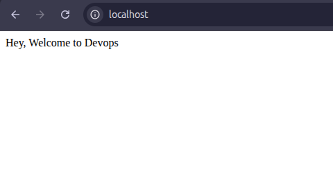
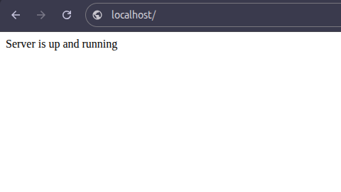

# Flask-Docker-App :whale2:
A simple Flask web application deployed using Docker.
This app has:
* Homepage: / → Displays “Hey, Welcome to Devops” (http://localhost)
* Health check: /health → Displays “Server is up and running” (http://localhost/health)

## :open_file_folder: Project Structure
flask-docker-app/

│

├── app.py             # Flask application

├── requirements.txt   # Python dependencies

├── Dockerfile         # Docker image instructions

└── README.md          # Project documentation

## app.py – Flask Application
* Imports the Flask library and creates an app instance.
* Defines two routes: / and /health.
* Runs the app on host 0.0.0.0 so Docker can expose it externally.

## requirements.txt – Python Dependencies
* Lists Python packages required for the app.
* Pinning versions ensures compatibility inside Docker.

## Dockerfile – Container Instructions
* FROM python:3.10-slim → Base image with Python installed.
* WORKDIR /app → Set the working directory inside the container.
* COPY . . → Copy all local files into container.
* RUN pip install -r requirements.txt → Install dependencies.
* ENTRYPOINT ["python", "app.py"] → Run Flask app when container starts.

## Build and Run the Docker Container :whale2:
### Step 1. Build Docker image by below command

docker build --no-cache -t flask-app .

Explanation:
* docker build → Builds a Docker image from the Dockerfile.
* -t flask-app → Tags the image as flask-app.
* . → Uses current directory as the build context.

### Step 2. Run Docker container by below command

docker run -d -p 80:80 flask-app

Explanation:
* docker run → Starts a container from the image.
* -d → Detached mode (runs in the background).
* -p 80:80 → Maps host port 80 to container port 80.
* flask-app → Name of the image to run.

### Step 3: Verify container is running by below command

docker ps

Explanation:
* Shows all running containers.

### Step 4: Access the Flask app in browser
* Homepage:

http://localhost/

* Health check:

http://localhost/health

### Step 5: View container logs (if needed)

docker logs <container_id>

Explanation:
* Useful to debug Python errors or missing packages.

## Example Output

## Best Practices
1. Flask must bind to 0.0.0.0 so it’s accessible outside the container.
2. Check Docker logs if the container crashes immediately.
3. Use --no-cache when rebuilding to avoid stale layers.

## :page_facing_up: License
This project is provided for learning and demonstration purposes.
Feel free to use, modify, and distribute.

